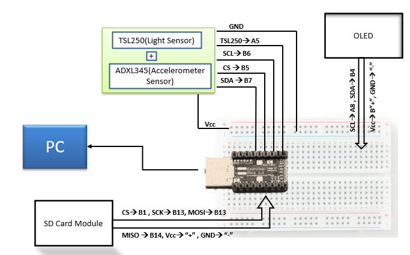

# Efficient-Data-Logger

## Project Description:
In this Project Espruino Pico microcontroller was used to log data from 3D Accelerometer sensor, Light Sensor and and visualize these data along with Date Time information in an OLED display.

## Requirements:

* Bread Board with Auxiliary Connectors
* Pico Controller
* ADXL345(Accelerometer Sensor)
* TSL250(Ambient Light Sensor) module
* SD Card Module
* OLED SSD1306

## Connectivity Overview

## Ripo Content:
* Presentation
* Output files

